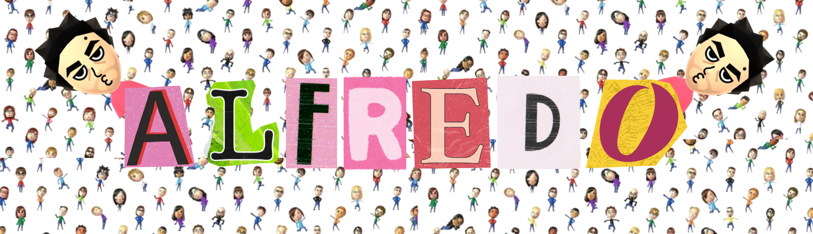

  
  
  <h1>Hola, soy Alfredo Martínez Cantero </h1>
  
  

    
    
    
  

  <h3>🚀 Desarrollador en formación | Web, Datos & Diseño UI</h3>
  
  

---

### 👨‍💻 Sobre mí

Soy estudiante de **Desarrollo de Aplicaciones Multiplataforma (DAM)**. Me defino como un desarrollador **junior** en formación: no solo me preocupa que la lógica del servidor sea segura y eficiente (**Backend**), sino también que la experiencia del usuario sea intuitiva y visualmente limpia (**Frontend**).

Busco el equilibrio perfecto entre la solidez de una buena base de datos y la creatividad de una interfaz moderna usando **HTML5 y CSS3**.

---

### 🛠️ Tech Stack & Herramientas

| **Frontend / Diseño** | **Backend / Lógica** | **Bases de Datos** | **DevOps & Tools** |
|:---:|:---:|:---:|:---:|
|     |     |     |     |

---

### 📊 Estadísticas

  
   
  

---

### 🏆 Proyectos Destacados

<table width="100%">
  <tr>
    <td width="50%" valign="top">
      <h3 align="center">🍺 Bar_Bara: Gestión Hostelera</h3>
      

        
        
      

       
      
Plataforma web integral para hostelería con interfaz adaptada a camareros y cocina.

      <ul>
        <li><strong>Frontend:</strong> Diseño de interfaz amigable para gestión táctil de pedidos usando <strong>CSS Grid</strong>.</li>
        <li><strong>Backend:</strong> Panel de administración robusto con estados de mesa dinámicos.</li>
        <li><strong>Full Stack:</strong> Conexión fluida entre la interfaz visual y la base de datos MySQL.</li>
      </ul>
    </td>
    <td width="50%" valign="top">
      <h3 align="center">🐍 Python Web IDE</h3>
      

        
        
      

       
      
Entorno de desarrollo que permite escribir y ejecutar Python desde el navegador.

      <ul>
        <li><strong>Frontend:</strong> Editor de código web con respuesta en tiempo real mediante <strong>JavaScript/Fetch</strong>.</li>
        <li><strong>Backend:</strong> Captura de salida <code>stdout</code> y gestión de sesiones seguras con Flask.</li>
        <li><strong>UX:</strong> Diseño limpio tipo "Terminal" para maximizar la legibilidad del código.</li>
      </ul>
    </td>
  </tr>
</table>

---

  
📫 <strong>¿Hablamos?</strong> <a href="mailto:alfredomartinezcantero@gmail.com">alfredomartinezcantero@gmail.com</a>

  
  

    
    
  

